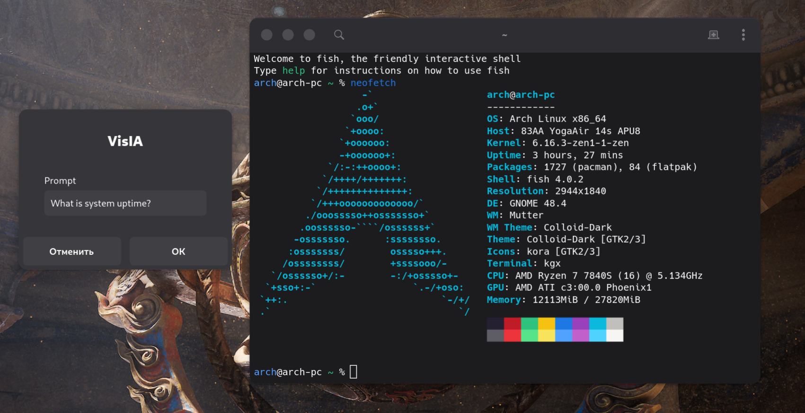
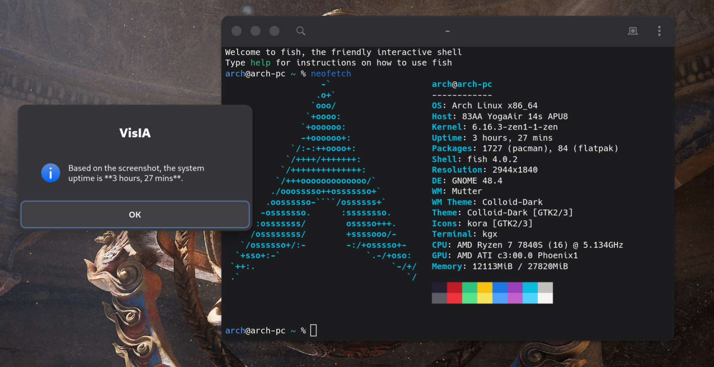

# VisIA: Visual Instant Ai




**VisIA** is a lightweight and powerful tool for instant interaction with visual content on your desktop using local artificial intelligence models. Designed for rapid integration into Linux users' workflows, VisIA allows you to instantly capture images and send them to Ollama for analysis, receiving responses directly on your screen.

## Features

*   **Instant AI Analysis:** Quickly send images to local LLMs (Ollama) for analysis and receive responses.
*   **Flexible Image Capture:** Capture screenshots of the entire screen, a selected area, or an active window (using `gnome-screenshot`), or use images from your clipboard.
*   **Interactive GUI:** Convenient pop-up windows based on `zenity` for model selection and prompt input.
*   **Command Line Interface (CLI) Mode:** Full control over VisIA's behavior for scripting or terminal use.
*   **GNOME Hotkey Integration:** Optimized for quick access to functionality via customizable shortcuts.
*   **Support for Multiple Ollama Models:** Easily switch between available models for various tasks.

## Requirements

The following components must be installed on your system for VisIA to work:

*   **Ollama:** A running Ollama server with one or more multimodal models installed (e.g., `gemma3`, `qwen2.5vl`). You can download Ollama from the [official website](https://ollama.com/) and install models using the `ollama pull <model_name>` command.
*   **Python 3.x:** A recent version of Python 3.
*   **`gnome-screenshot`:** A utility for taking screenshots. It is usually pre-installed in most GNOME-oriented distributions.
*   **`zenity`:** A tool for displaying graphical dialog boxes. Also typically pre-installed in GNOME.

## GNOME Integration (Hotkeys)

VisIA is designed for deep integration into the GNOME environment for quick and convenient access via hotkeys.

1.  **Make VisIA accessible in PATH:**
    For convenience and the ability to run `visia` from any directory (and via hotkeys), it is recommended to create a symbolic link to the executable file in one of the directories specified in your `PATH` environment variable (e.g., `/usr/local/bin`).

    ```bash
    sudo ln -s /path/to/your/VisIA/visia /usr/local/bin/visia
    ```
    *Replace `/path/to/your/VisIA/` with the actual path to your project.*

2.  **Configure custom hotkeys in GNOME:**
    *   Open GNOME **"Settings"**.
    *   Navigate to the **"Keyboard"** section.
    *   Scroll down to **"Custom Shortcuts"**.
    *   Click **"+"** to add a new shortcut.
    *   Set a **"Name"** for each shortcut, for example, "VisIA: Area", "VisIA: Clipboard".
    *   In the **"Command"** field, specify the corresponding `visia` commands with flags.
    *   Assign your desired **"Shortcut"** key combination.

**Hotkey Command Examples:**

| Action                                     | Command for GNOME Shortcut                    | Example Hotkey            |
| :----------------------------------------- | :-------------------------------------------- | :------------------------ |
| Capture **screen area**                    | `visia gui --area`                            | `Super + A`               |
| Capture **full screen**                    | `visia gui`                                   | `Super + Shift + A`       |
| Capture **area**, **model selection**      | `visia gui --area --choose`                   | `Ctrl + Super + A`        |
| Capture **full screen**, **model selection** | `visia gui --choose`                          | `Ctrl + Super + Shift + A`|
| Use **image from clipboard**               | `visia gui --clip`                            | `Super + C` (or another)  |
| Use **image from clipboard**, **model selection** | `visia gui --clip --choose`                   | `Ctrl + Super + C` (or another) |

*Note: You can configure any convenient key combinations. Make sure they do not conflict with existing system shortcuts.*

## Installation

Follow these steps to install VisIA:

1.  **Clone the repository:**
    ```bash
    git clone https://github.com/architector1324/visia.git
    cd VisIA
    ```

2.  **Build the executable:**
    Use the `build.sh` script to create an isolated environment and compile VisIA into a single executable file.
    ```bash
    ./build.sh
    ```
    After successful execution, the `visia` executable will be located in the project's root directory.
